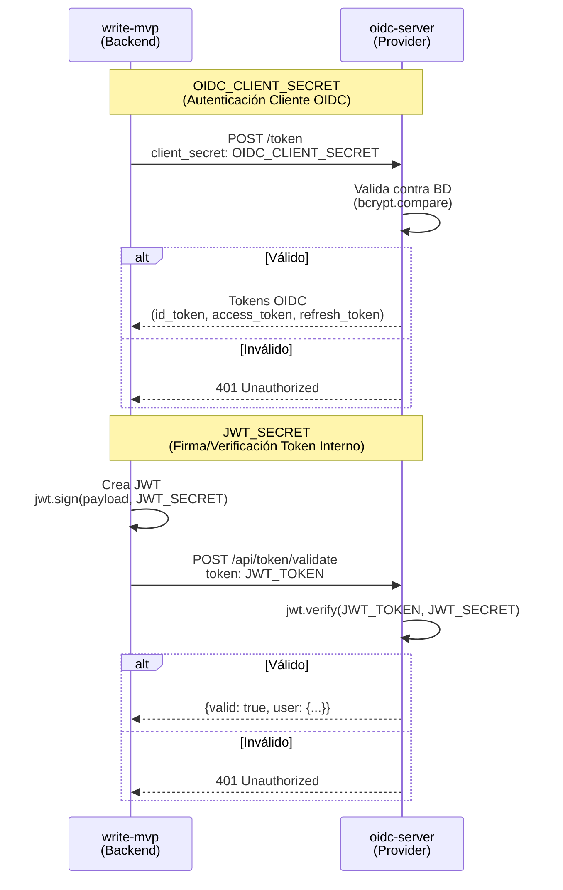

# Diagrama de Secuencia - Flujo de Autenticación OIDC

Este diagrama muestra el uso de `OIDC_CLIENT_SECRET` y `JWT_SECRET` en el flujo completo de autenticación.

## Diagrama de Secuencia Completo

```mermaid
sequenceDiagram
    participant U as Usuario<br/>(Browser)
    participant F as Frontend<br/>(write-mvp/web)
    participant B as Backend<br/>(write-mvp/api)
    participant O as OIDC Server<br/>(provider)
    participant DB as Database<br/>(PostgreSQL)

    Note over U,DB: FASE 1: Flujo OIDC (usa OIDC_CLIENT_SECRET)
    
    U->>F: 1. Click "Login"
    F->>B: 2. GET /auth/login
    B->>B: 3. Genera state (CSRF token)
    B->>B: 4. Crea cookie con state
    B->>F: 5. Redirect a OIDC (con state)
    F->>U: 6. Redirect HTTP 302
    U->>O: 7. GET /auth?client_id=...&state=...
    
    Note over O: Usuario se autentica<br/>(login, password)
    
    O->>DB: 8. Validar credenciales usuario
    DB-->>O: 9. Usuario válido + company_id
    O->>O: 10. Genera código de autorización
    O->>U: 11. Redirect a callback<br/>?code=AUTH_CODE&state=...
    U->>B: 12. GET /auth/callback?code=...&state=...
    
    Note over B,O: INTERCAMBIO CÓDIGO POR TOKENS<br/>(usa OIDC_CLIENT_SECRET)
    
    B->>B: 13. Valida state (CSRF)
    B->>O: 14. POST /token<br/>grant_type=authorization_code<br/>code=AUTH_CODE<br/>client_id=writehub-client<br/>client_secret=OIDC_CLIENT_SECRET
    
    Note over O: VALIDACIÓN OIDC_CLIENT_SECRET
    
    O->>DB: 15. Buscar cliente por client_id
    DB-->>O: 16. Cliente encontrado<br/>(client_secret hasheado)
    O->>O: 17. bcrypt.compare(<br/>OIDC_CLIENT_SECRET,<br/>stored_hash)
    alt OIDC_CLIENT_SECRET válido
        O->>O: 18. Genera tokens OIDC<br/>(id_token, access_token, refresh_token)
        O-->>B: 19. 200 OK<br/>{id_token, access_token, refresh_token}
    else OIDC_CLIENT_SECRET inválido
        O-->>B: 19. 401 Unauthorized<br/>{error: "invalid_client"}
        B->>U: Error de autenticación
    end
    
    Note over U,DB: FASE 2: Creación Token JWT Interno (usa JWT_SECRET)
    
    B->>O: 20. GET /me<br/>Authorization: Bearer access_token
    O-->>B: 21. UserInfo<br/>{sub, email, name, company_id}
    
    B->>B: 22. Crea token JWT interno<br/>jwt.sign({<br/>  sub, email, name,<br/>  company_id,<br/>  id_token, access_token,<br/>  refresh_token<br/>}, JWT_SECRET)
    
    Note over B: Token JWT firmado con<br/>JWT_SECRET
    
    B->>B: 23. Establece cookie de sesión<br/>(httpOnly, secure)
    B->>F: 24. Redirect a /dashboard
    F->>U: 25. Muestra dashboard
    
    Note over U,DB: FASE 3: Validación Token JWT (usa JWT_SECRET)
    
    U->>F: 26. Navega a página protegida
    F->>B: 27. GET /api/protected<br/>Cookie: session_token=JWT_TOKEN
    
    Note over B,O: VALIDACIÓN JWT_SECRET
    
    B->>O: 28. POST /api/token/validate<br/>Body: {token: JWT_TOKEN}<br/>Query: client_id=writehub-client
    
    O->>O: 29. jwt.verify(JWT_TOKEN, JWT_SECRET)
    
    alt JWT_SECRET coincide
        O->>O: 30. Token válido<br/>Extrae payload<br/>{sub, email, name, company_id}
        O->>DB: 31. Verificar acceso<br/>company_id → client_id
        DB-->>O: 32. Acceso permitido
        O-->>B: 33. 200 OK<br/>{valid: true, user: {...}}
        B->>B: 34. Adjunta user a request
        B-->>F: 35. 200 OK<br/>{data: "..."}
        F->>U: 36. Muestra contenido protegido
    else JWT_SECRET no coincide
        O-->>B: 33. 401 Unauthorized<br/>{error: "Invalid token signature"}
        B-->>F: 35. 401 Unauthorized
        F->>U: 36. Redirect a login
    end
    
    Note over U,DB: FASE 4: Refresh Token (usa ambos secretos)
    
    U->>F: 37. Token JWT expirado
    F->>B: 38. POST /auth/refresh<br/>Cookie: session_token=JWT_TOKEN
    
    B->>B: 39. Decodifica JWT_TOKEN<br/>(extrae refresh_token)
    B->>O: 40. POST /token<br/>grant_type=refresh_token<br/>refresh_token=...<br/>client_id=writehub-client<br/>client_secret=OIDC_CLIENT_SECRET
    
    Note over O: VALIDACIÓN OIDC_CLIENT_SECRET<br/>(nuevamente)
    
    O->>DB: 41. Validar refresh_token
    DB-->>O: 42. Refresh token válido
    O->>O: 43. Genera nuevos tokens OIDC
    O-->>B: 44. Nuevos tokens OIDC
    
    B->>B: 45. Crea nuevo JWT interno<br/>jwt.sign({...}, JWT_SECRET)
    B->>B: 46. Actualiza cookie de sesión
    B-->>F: 47. Nuevo token JWT
    F->>U: 48. Sesión renovada
```

## Diagrama Simplificado - Comparación de Secretos

## Resumen de Uso de Secretos

### OIDC_CLIENT_SECRET
- **Cuándo se usa**: En el intercambio código de autorización → tokens OIDC
- **Dónde se valida**: Endpoint `/token` del oidc-server
- **Propósito**: Autenticar que la aplicación cliente es legítima
- **Almacenamiento**: Base de datos (hasheado con bcrypt)
- **Frecuencia**: Una vez por sesión inicial y en refresh tokens

### JWT_SECRET
- **Cuándo se usa**: 
  1. Al crear token JWT interno en write-mvp
  2. Al validar token JWT en oidc-server
- **Dónde se valida**: Endpoint `/api/token/validate` del oidc-server
- **Propósito**: Garantizar que el token JWT interno no fue modificado
- **Almacenamiento**: Variable de entorno (mismo valor en ambos servicios)
- **Frecuencia**: En cada request protegido que requiere validación

## Puntos Clave

1. **OIDC_CLIENT_SECRET** se usa SOLO en el flujo OIDC estándar (intercambio de tokens)
2. **JWT_SECRET** se usa para tokens internos de write-mvp (sesión de usuario)
3. Ambos son necesarios pero para propósitos diferentes
4. Si cambias uno, no afecta al otro (son independientes)
5. Ambos deben ser seguros y únicos

