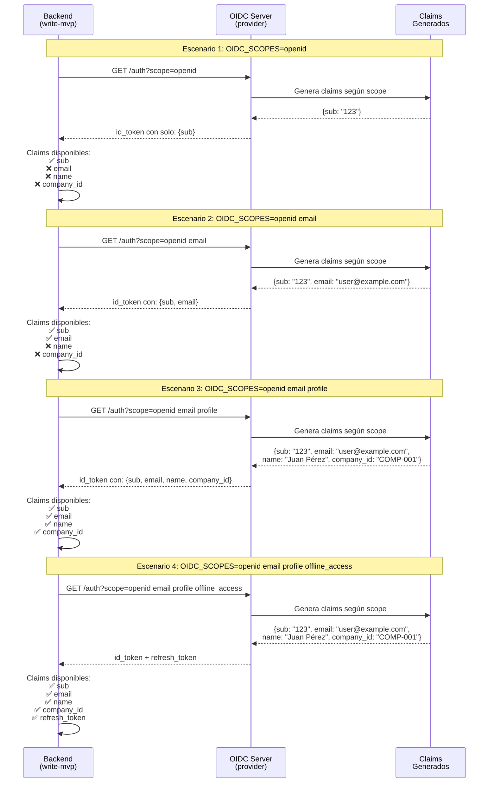
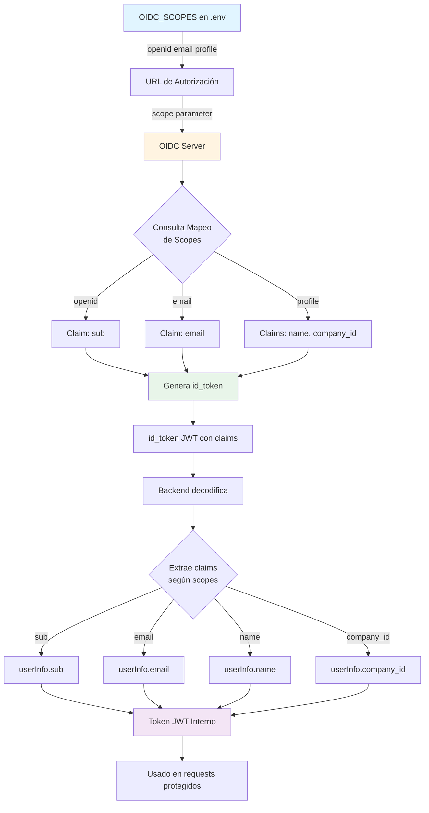
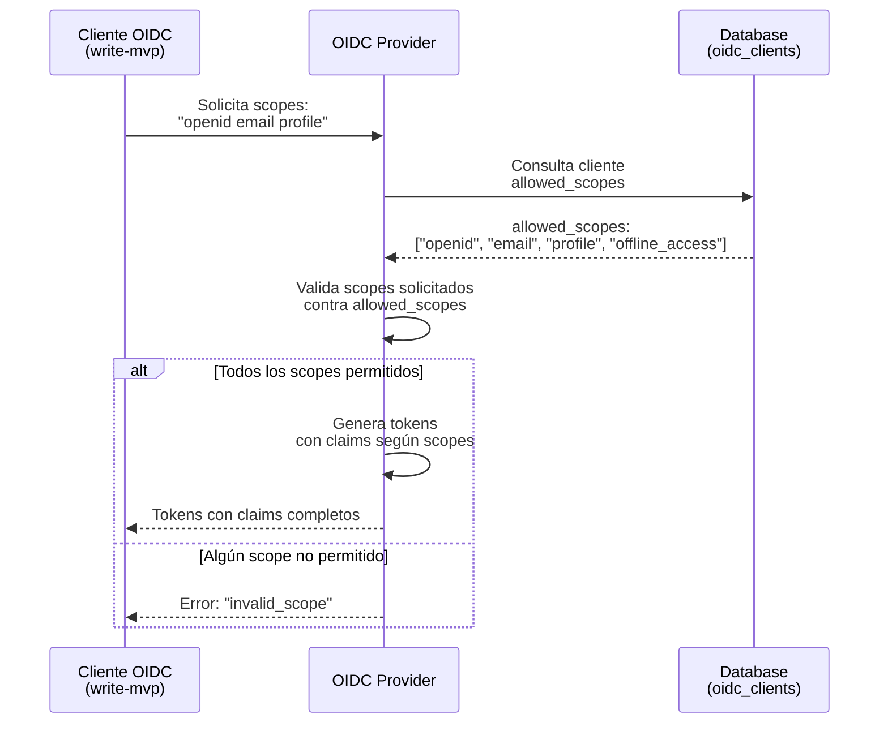

# Diagrama de Secuencia - OIDC Scopes y Claims

Este diagrama muestra cómo funcionan los `OIDC_SCOPES` en el flujo de autenticación OIDC, desde la solicitud hasta la extracción de claims.

## Diagrama de Secuencia Completo - OIDC Scopes

```mermaid
sequenceDiagram
    participant U as Usuario<br/>(Browser)
    participant F as Frontend<br/>(write-mvp/web)
    participant B as Backend<br/>(write-mvp/api)
    participant O as OIDC Server<br/>(provider)
    participant DB as Database<br/>(PostgreSQL)
    participant Config as Config<br/>(claims mapping)

    Note over U,Config: FASE 1: Solicitud de Scopes en URL de Autorización

    U->>F: 1. Click "Login"
    F->>B: 2. GET /auth/login
    B->>B: 3. Lee OIDC_SCOPES<br/>del .env<br/>"openid email profile"
    B->>B: 4. Construye URL de autorización<br/>con scope parameter

    Note over B: URL generada:<br/>/auth?client_id=...&<br/>scope=openid email profile&<br/>redirect_uri=...&state=...

    B->>F: 5. Redirect a OIDC (con scopes)
    F->>U: 6. Redirect HTTP 302
    U->>O: 7. GET /auth?scope=openid email profile&...

    Note over O,Config: FASE 2: Mapeo de Scopes a Claims

    O->>Config: 8. Consulta mapeo de scopes<br/>claims: {<br/>  openid: ['sub'],<br/>  email: ['email'],<br/>  profile: ['name', 'company_id']<br/>}
    Config-->>O: 9. Mapeo de scopes recibido

    Note over O: Scopes solicitados:<br/>- openid → claim: sub<br/>- email → claim: email<br/>- profile → claims: name, company_id

    Note over U,Config: FASE 3: Autenticación y Generación de Claims

    O->>U: 10. Muestra formulario de login
    U->>O: 11. Envía credenciales<br/>(email, password)
    O->>DB: 12. Validar credenciales usuario
    DB-->>O: 13. Usuario válido<br/>{id, email, name, company_id}

    Note over O: Usuario encontrado:<br/>{<br/>  id: "123",<br/>  email: "usuario@ejemplo.com",<br/>  name: "Juan Pérez",<br/>  company_id: "COMP-001"<br/>}

    O->>O: 14. Genera código de autorización<br/>(incluye scopes solicitados)
    O->>U: 15. Redirect a callback<br/>?code=AUTH_CODE&state=...

    Note over U,Config: FASE 4: Intercambio Código por Tokens (con Scopes)

    U->>B: 16. GET /auth/callback?code=...&state=...
    B->>B: 17. Valida state (CSRF)
    B->>O: 18. POST /token<br/>grant_type=authorization_code<br/>code=AUTH_CODE<br/>client_id=writehub-client<br/>client_secret=OIDC_CLIENT_SECRET

    Note over O: El código contiene<br/>los scopes originales<br/>solicitados

    O->>DB: 19. Validar código de autorización<br/>(verificar scopes permitidos)
    DB-->>O: 20. Código válido<br/>Scopes permitidos: openid, email, profile

    Note over O,Config: FASE 5: Generación de Claims según Scopes

    O->>O: 21. Llama función claims()<br/>con scopes: "openid email profile"

    Note over O: claims(use, scope, claims, rejected)

    O->>O: 22. Genera claims según scope:<br/>{<br/>  sub: "123" (de openid),<br/>  email: "usuario@ejemplo.com" (de email),<br/>  name: "Juan Pérez" (de profile),<br/>  company_id: "COMP-001" (de profile)<br/>}

    Note over O: Claims filtrados según<br/>scopes solicitados

    O->>O: 23. Genera id_token JWT<br/>con claims incluidos
    O->>O: 24. Genera access_token<br/>(para /me endpoint)
    O->>O: 25. Genera refresh_token<br/>(si offline_access presente)

    O-->>B: 26. 200 OK<br/>{<br/>  id_token: "eyJ...",<br/>  access_token: "eyJ...",<br/>  refresh_token: "eyJ..."<br/>}

    Note over U,Config: FASE 6: Extracción de Claims del id_token

    B->>B: 27. Decodifica id_token JWT<br/>jwt.decode(id_token)

    Note over B: Payload del id_token:<br/>{<br/>  sub: "123",<br/>  email: "usuario@ejemplo.com",<br/>  name: "Juan Pérez",<br/>  company_id: "COMP-001",<br/>  exp: 1234567890,<br/>  iat: 1234567800<br/>}

    B->>B: 28. Extrae claims según scopes:<br/>{<br/>  sub: payload.sub,<br/>  email: payload.email,<br/>  name: payload.name,<br/>  company_id: payload.company_id<br/>}

    Note over B: Claims disponibles porque<br/>scopes solicitados fueron:<br/>openid email profile

    B->>B: 29. Crea token JWT interno<br/>con claims extraídos
    B->>F: 30. Redirect a /dashboard<br/>(con cookie de sesión)
    F->>U: 31. Muestra dashboard<br/>(con nombre, email, company_id)

    Note over U,Config: FASE 7: Uso de Claims en Requests Protegidos

    U->>F: 32. Navega a página protegida
    F->>B: 33. GET /api/protected<br/>Cookie: session_token=JWT_TOKEN
    B->>O: 34. POST /api/token/validate<br/>token: JWT_TOKEN
    O->>O: 35. Verifica token<br/>Extrae claims del payload
    O-->>B: 36. {valid: true, user: {<br/>  sub: "123",<br/>  email: "usuario@ejemplo.com",<br/>  name: "Juan Pérez",<br/>  company_id: "COMP-001"<br/>}}
    B->>B: 37. Usa claims para autorización<br/>(company_id para filtrado)
    B-->>F: 38. Datos filtrados por company_id
    F->>U: 39. Muestra contenido<br/>(según company_id)
```



## Diagrama Comparativo - Diferentes Configuraciones de Scopes



## Diagrama de Mapeo Scopes → Claims



## Tabla de Mapeo Scopes → Claims

| Scope Solicitado | Claims Incluidos en id_token        | Disponible en userInfo  |
| ---------------- | ----------------------------------- | ----------------------- |
| `openid`         | `sub`                               | ✅ `sub`                |
| `email`          | `email`                             | ✅ `email`              |
| `profile`        | `name`, `company_id`                | ✅ `name`, `company_id` |
| `address`        | `address`                           | ❌ No configurado       |
| `phone`          | `phone_number`                      | ❌ No configurado       |
| `offline_access` | `refresh_token` (en token response) | ✅ `refresh_token`      |

## Ejemplo de id_token según Scopes

### Con `OIDC_SCOPES=openid`

```json
{
  "sub": "123",
  "iat": 1234567800,
  "exp": 1234567890
}
```

### Con `OIDC_SCOPES=openid email`

```json
{
  "sub": "123",
  "email": "usuario@ejemplo.com",
  "iat": 1234567800,
  "exp": 1234567890
}
```

### Con `OIDC_SCOPES=openid email profile` (Actual)

```json
{
  "sub": "123",
  "email": "usuario@ejemplo.com",
  "name": "Juan Pérez",
  "company_id": "COMP-001",
  "iat": 1234567800,
  "exp": 1234567890
}
```

## Flujo de Validación de Scopes



## Puntos Clave

1. **Los scopes se solicitan en la URL de autorización** - Se envían como parámetro `scope` en el GET `/auth`

2. **El servidor OIDC mapea scopes a claims** - La configuración `claims` en el provider define qué claims incluye cada scope

3. **Los claims se incluyen en el id_token** - El id_token JWT contiene solo los claims correspondientes a los scopes solicitados

4. **El backend extrae claims del id_token** - Se decodifica el JWT y se extraen los claims según los scopes solicitados

5. **Los claims se usan para autorización** - El `company_id` se usa para filtrar datos según la compañía del usuario

6. **Scopes adicionales requieren configuración** - Para usar `address`, `phone`, o `offline_access`, debes:
   - Agregar el mapeo en `claims` del provider
   - Configurar el cliente OIDC para permitir esos scopes
   - Actualizar `OIDC_SCOPES` en el .env

## Recomendaciones

- **Desarrollo**: `OIDC_SCOPES=openid email profile`
- **Producción**: `OIDC_SCOPES=openid email profile offline_access`
- **Mínimo necesario**: `OIDC_SCOPES=openid email` (si no necesitas nombre ni company_id)
